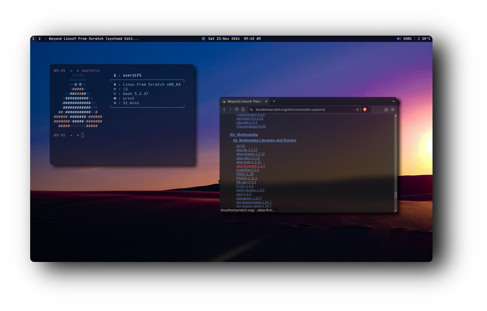
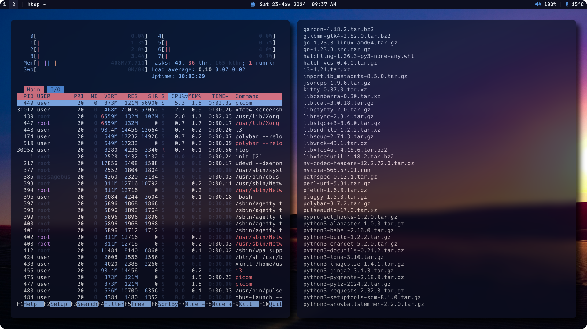

<div align="center">
  <h1>☄️ <strong>𝗶𝟯𝗪𝗠 ◄► 𝗗𝗢𝗧𝗙𝗜𝗟𝗘𝗦</strong> ☄️</h1>
</div>


<div align="center">
  <h2 style="font-size: 24px;">
    <strong> <a href="https://i3wm.org/" style="text-decoration: none; color: inherit;">
      
      i3 Window Manager</a> 
    </strong>
  </h2>
</div>


```css
      __/)   ‌‌‌‌‬‬‬‍ ‌‌‌‌‌‬‌‌   ‌‌‌‌‌‌‬ ‌‌‌‌‌‌‌‌‌‌‌‌‌‬        ‌‌‌‌‌‌‬_      ‌‌‌‌‌‬‌‌_       ‌‌‌‌‍‬  ‌‌‌‌‍‍ 
   .‌‌‌‌‍‬‌-(_‌‌‌‌‌‍‌_(=:   |   ‌‌‌‌‍‬‌   ‌‌‌‌‍‬‍‍   ‌‌‌‌‌‬‌‌ | | o  | |     ‌‌‌‌‌‌    
‌‌‌‌‍‬‌‍|\ |    \) ‌‌‌‌‍‬‌ _‌‌‌‌‍‍‌_| ‌‌‌‌‍‬‍‍  __ ‌‌‌‌‍‌‬_|‌‌‌‌‍‬‬_ | |‌‌‌‌‍‬‌‍    |‌‌‌‌‍‍‌ |  _ ‌‌‌‌‍‬‍‍  , ‌‌‌‌‌‬‍ 
‌‌‌‌‍‌\‌‌‌‌‍‬‍‍ ||       / ‌‌‌‌‌‍ ‌‌‌‌‍‬‍‍|  /  \_|  |/‌‌‌‌‍‬‬  |  |/  |/  / \‌‌‌‌‍‌‌‌‌‌‌‌‍‌‌_
 \||     ‌‌‌‌‍‬‍  \_/|_/\__/ |_‌‌‌‌‌‬‬/‌‌‌‌‍‬‍|__/|_‌‌‌‌‍‬‍‍/|__/‌‌‌‌‌‬|__/ \/ 
  \|                     |\                 
   |      Dotfiles       |/  Made by @user7210unix
```
---

<h1>
      
</div>
</div> 
  
## ⚙️ Features
- **Window Manager** :bento: [i3](https://i3wm.org/) Clean theme!
- **Panel** :blossom: [Polybar](https://github.com/polybar/polybar) with glyphs!
- **Application Launcher** :rocket: [Rofi](https://github.com/davatorium/rofi) which blazing fast!
- **Desktop Notification** :herb: [Dunst](https://github.com/dunst-project/dunst) which minimalist!
- **Terminal Emulator** :leaves: [Rxvt](http://software.schmorp.de/pkg/rxvt-unicode.html) which lightest!
- **Shell** :shell: [Fish](https://fishshell.com/) Best Shell!
- **Compositor** :shaved_ice: [Picom](https://github.com/yshui/picom) for perfection topping!
- **File Manager** :flower_playing_cards: [Thunar](https://docs.xfce.org/xfce/thunar/start) customized side-pane!

### :octocat: ‎ <sup><sub><samp>HI THERE! THANKS FOR DROPPING BY!</samp></sub></sup>

---

## 📑 Table of Contents

- [🚀 Features](#features)
- [📥 Installation Guide](#installation-guide)
- [🛠️ Dependencies](#dependencies)
- [🔑 Key Bindings](#key-bindings)

---

<div style="display: flex; align-items: center; margin-bottom: 40px;">
  <div style="flex: 1; padding-right: 20px;">
    <p><strong>🚀 Resource Efficiency</strong></p>
    <p>Optimized for performance and minimal resource usage. On average, my setup consumes between <strong>250 MB and 400 MB of RAM</strong>, depending on the installed packages and background services. This lightweight configuration maximizes system resources for essential tasks and keeps everything running smoothly.</p>
  </div>
  <div style="flex: 1;">
    
  </div>
</div>

---
### 🔑 Key Bindings

#### 📱 **Applications**

- **$mod+q** – Close window  
- **$mod+Return** – Open terminal (RXVT)  
- **$mod+f** – Launch FIREFOX  
- **$mod+d** – Run ROFI  
- **$mod+e** – Open file manager (THUNAR)  

#### ⚙️ **Miscellaneous**

- **$mod+Shift+c** – Reload i3 configuration  
- **$mod+Shift+e** – Exit i3 session

---

## 📦 Dependencies


**Arch Linux 🔷**

To install the necessary dependencies on Arch Linux, run:

> ```sudo pacman -S rxvt-unicode polybar fish i3 unzip```

**Debian ❣️ - (Ubuntu 🍊 - Mint 🍏)**

For Debian-based distributions, use the following command:


> ```sudo apt install rxvt-unicode polybar fish i3 unzip```

**Gentoo 🧼**

On Gentoo, you can install the required packages using:


> ```root # emerge: --ask x11-terms/rxvt-unicode polybar x11-wm/i3 unzip```

 > Fish Shell Wiki
    (https://wiki.gentoo.org/wiki/Fish)

**Fedora Linux 🌊**

To install the necessary dependencies on Arch Linux, run:

> ```sudo dnf install rxvt-unicode polybar fish i3 unzip```

**OpenSUSE 🦎**

For OpenSUSE distribution, use the following command:


> ```sudo zypper install neofetch rxvt-unicode fish polybar i3 unzip ```

---

## 💦 PICOM-FORK
You will need install all packages listed in the repo (https://github.com/pijulius/picom/tree/implement-window-animations) first to compile this Custom Picom Fork, if not the picom.conf Configuration will not work

> ```git clone https://github.com/pijulius/picom.git && cd picom && meson --buildtype=release . build && ninja -C build && ninja -C build install```

---

## ✍️ FONTS
> ``` mkdir $HOME/.fonts && wget https://github.com/ryanoasis/nerd-fonts/releases/download/v3.3.0/JetBrainsMono.zip && unzip JetBrainsMono.zip && wget https://github.com/ryanoasis/nerd-fonts/releases/download/v3.3.0/Hack.zip && unzip Hack.zip && fc-cache -vf```

---


### 🐦 Clone the Repository 
First, clone the repository containing my personal i3 setup:

```bash git clone https://github.com/user7210unix/i3-perfect-dotfiles.git```

---
