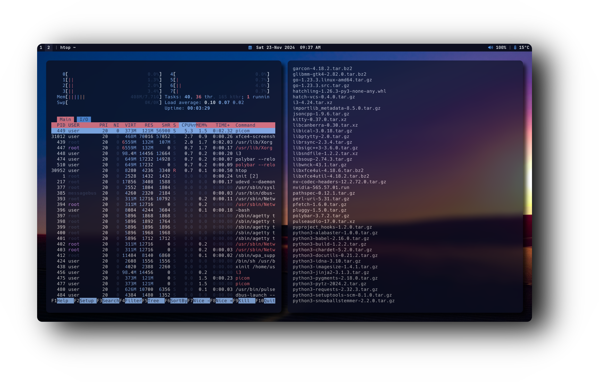

# 🚀 𝕚𝟛-𝕊𝕖𝕥𝕦𝕡 🚀
> **Winddow Manager**: [i3 Window Manager](https://i3wm.org/)

## ⚙️ Features
<div style="display: flex; align-items: center;">
  <div style="flex: 1; padding-right: 20px;">
    <ul>
      <li>🖥️ <strong>i3 Window Manager</strong> - For a lightweight and efficient, tiling window workflow</li>
      <li>🐟 <strong>Fish Shell</strong> - User-friendly and powerful shell with <a href="https://github.com/oh-my-fish/oh-my-fish">Oh My Fish</a> customization</li>
      <li>💻 <strong>URxvt Terminal</strong> - Compiled from source for a minimalist, efficient experience</li>
      <li>🎨 <strong>Customization</strong> - A fully tailored environment designed for my workflow and aesthetic preferences</li>
      <li>🛠️ <strong>Hands-On Learning</strong> - Building everything from source helps me understand Linux in-depth</li>
    </ul>
  </div>
  <div style="flex: 1;">
    
  </div>
</div>

---

## 📑 Table of Contents

- [🚀 Features](#features)
- [📥 Installation Guide](#installation-guide)
- [🛠️ Dependencies](#dependencies)
- [🔑 Key Bindings](#key-bindings)

---

<div style="display: flex; align-items: center; margin-bottom: 40px;">
  <div style="flex: 1; padding-right: 20px;">
    <p><strong>🚀 Resource Efficiency</strong></p>
    <p>Optimized for performance and minimal resource usage. On average, my setup consumes between <strong>250 MB and 400 MB of RAM</strong>, depending on the installed packages and background services. This lightweight configuration maximizes system resources for essential tasks and keeps everything running smoothly.</p>
  </div>
  <div style="flex: 1;">
    
  </div>
</div>

---
### 🔑 Key Bindings

#### 📱 **Applications**

- **$mod+q** – Close window  
- **$mod+Return** – Open terminal (URxvt)  
- **$mod+f** – Launch Brave  
- **$mod+d** – Run rofi  
- **$mod+e** – Open file manager (PCManFM)  

#### ⚙️ **Miscellaneous**

- **$mod+Shift+c** – Reload i3 configuration  
- **$mod+Shift+e** – Exit i3 session

---

## 📦 Dependencies


**Arch Linux 🔷**

To install the necessary dependencies on Arch Linux, run:

```console sudo pacman -S rxvt-unicode polybar fish i3```

**Fedora Linux 🔷**

To install the necessary dependencies on Arch Linux, run:

```console sudo dnf install rxvt-unicode polybar fish i3```

**Debian ❣️ - (Ubuntu 🍊 - Mint 🍏)**

For Debian-based distributions, use the following command:


```console sudo apt install rxvt-unicode polybar fish i3```

**Gentoo 🧼**

On Gentoo, you can install the required packages using:


```console root # emerge --ask x11-terms/rxvt-unicode polybar x11-wm/i3```

 > Fish Shell Wiki
    (https://wiki.gentoo.org/wiki/Fish)


**OpenSUSE 🦎**

For OpenSUSE distribution, use the following command:


```console sudo zypper install neofetch rxvt-unicode fish polybar i3```


**PICOM-FORK**
You will need install all packages listed in the repo (https://github.com/pijulius/picom/tree/implement-window-animations) first to compile this Custom Picom Fork, if not the picom.conf Configuration will not work

```bash git clone https://github.com/pijulius/picom.git && cd picom && meson --buildtype=release . build && ninja -C build && ninja -C build install```

## 📥 Clone Dotfiles

To set up this i3 Configuration, follow the steps below. Make sure you have the necessary dependencies installed for your distribution (refer to the **Dependencies** section).

### 1. Clone the Repository
First, clone the repository containing my personal i3 setup:

```bash
git clone https://github.com/user7210unix/i3-perfect-dotfiles.git```

